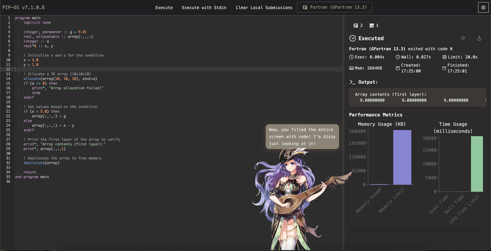

[main branch](https://code.cansu.dev)

[development branch](https://haul.code-cansu-dev.pages.dev) *unstable*

## beep

Code playground with 38 different environments, all with autocompletes, snippets, and syntax highlighters.

- [beep](#beep)
- [features](#features)
- [supported languages](#supported-languages)

## features

- Autocomplete and Snippets

- Share Code Output

- Live2D Model that reacts to your code after execution

- Stdin Support

- Execution and Loading Speed

- Network Friendly

From Haskell to NASM to Prolog to Lua, run everything with under 2 MB of network (3.7 MB including anime girl), all autocompletes and snippets included.

As a comparison, with no cache, from initial load to output, JDoodle consumes 3.05 megabytes for only loading COBOL. My precious darling loads needs only 1.6 MB of network initially, 
for loading all languages. Language switch takes almost nothing, where as JDoodle transfers 6 MB of network just to switch from COBOL to Fortran. 

Cached initial network transfer is only 4 KB, and executions, submissions, etc. takes only a few kilobytes per query.
more to come, wip.

## supported languages

* [Assembly (NASM 2.16.03)](https://code.cansu.dev/language/redirect/assembly)
* [Bash (5.0.0)](https://code.cansu.dev/language/redirect/bash)
* [C (GCC 7.4.0)](https://code.cansu.dev/language/redirect/c)
* [C++ (GCC 10.2)](https://code.cansu.dev/language/redirect/cpp)
* [Common Lisp (SBCL 2.4.9)](https://code.cansu.dev/language/redirect/lisp)
* [D (DMD 2.109.1)](https://code.cansu.dev/language/redirect/d)
* [Elixir (1.17.3)](https://code.cansu.dev/language/redirect/elixir)
* [Erlang (OTP 27.1.2)](https://code.cansu.dev/language/redirect/erlang)
* [Fortran (GFortran 13.3)](https://code.cansu.dev/language/redirect/fortran)
* [Go (1.23.2)](https://code.cansu.dev/language/redirect/go)
* [Haskell (7.8.4)](https://code.cansu.dev/language/redirect/haskell)
* [Java (OpenJDK 23)](https://code.cansu.dev/language/redirect/java)
* [JavaScript (Bun 1.1.33)](https://code.cansu.dev/language/redirect/javascript)
* [Lua (5.4.7)](https://code.cansu.dev/language/redirect/lua)
* [OCaml (5.2.0)](https://code.cansu.dev/language/redirect/ocaml)
* [Octave (9.2.0)](https://code.cansu.dev/language/redirect/octave)
* [Pascal (FPC 3.2.2)](https://code.cansu.dev/language/redirect/pascal)
* [PHP (8.3.13)](https://code.cansu.dev/language/redirect/php)
* [Prolog (GNU Prolog 1.4.5)](https://code.cansu.dev/language/redirect/prolog)
* [Python (2.7.17)](https://code.cansu.dev/language/redirect/python)
* [Ruby (2.7.0)](https://code.cansu.dev/language/redirect/ruby)
* [Rust (1.82.0)](https://code.cansu.dev/language/redirect/rust)
* [TypeScript (Bun 1.1.33)](https://code.cansu.dev/language/redirect/typescript)
* [COBOL (GnuCOBOL 3.1.2)](https://code.cansu.dev/language/redirect/cobol)
* [Kotlin (2.0.21)](https://code.cansu.dev/language/redirect/kotlin)
* [Objective-C (Clang 7.0.1)](https://code.cansu.dev/language/redirect/objectivec)
* [R (4.4.1)](https://code.cansu.dev/language/redirect/r)
* [Scala (3.5.2)](https://code.cansu.dev/language/redirect/scala)
* [SQL (SQLite 3.46.1.1)](https://code.cansu.dev/language/redirect/sql)
* [Swift (6.0.1)](https://code.cansu.dev/language/redirect/swift)
* [Visual Basic.Net (vbnc 0.0.0.5943)](https://code.cansu.dev/language/redirect/vbnc)
* [Perl (5.40.0)](https://code.cansu.dev/language/redirect/perl)
* [Clojure (1.11.2)](https://code.cansu.dev/language/redirect/clojure)
* [Nim (2.2.0)](https://code.cansu.dev/language/redirect/nim)
* [Groovy (4.0.23)](https://code.cansu.dev/language/redirect/groovy)

changelog, contact, etc is in the `public/readme.md`.

palette: #211e20 #504945 #2c2a2a #3c3836, for text, either #e9efec or #9ca3af