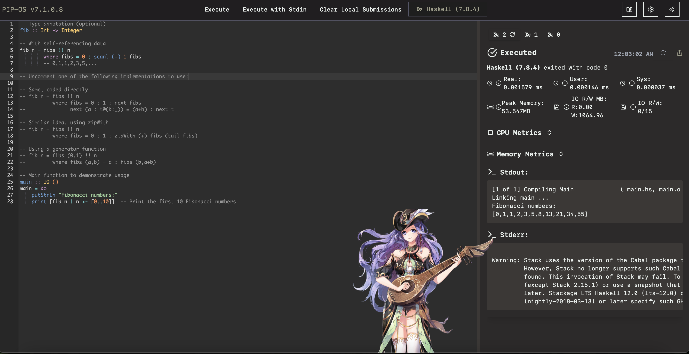
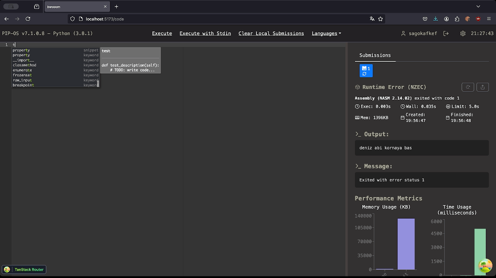
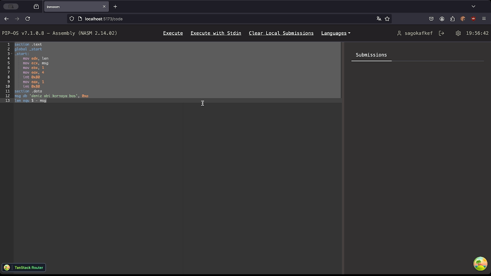
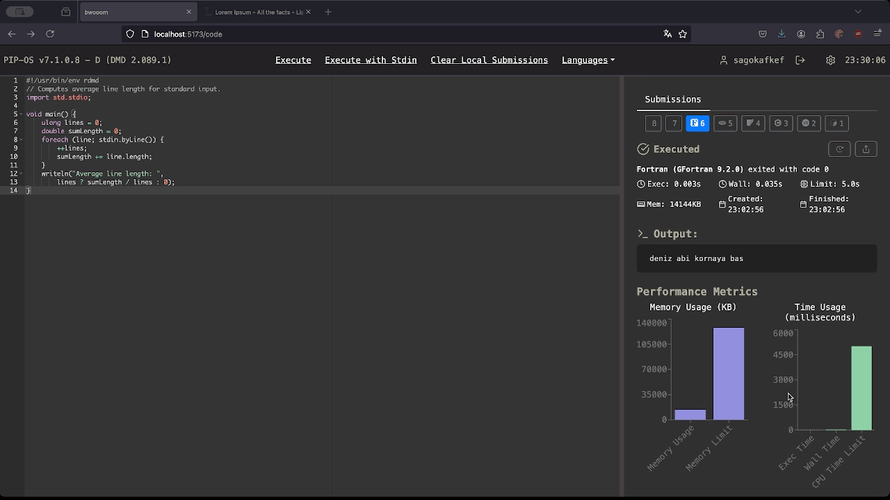
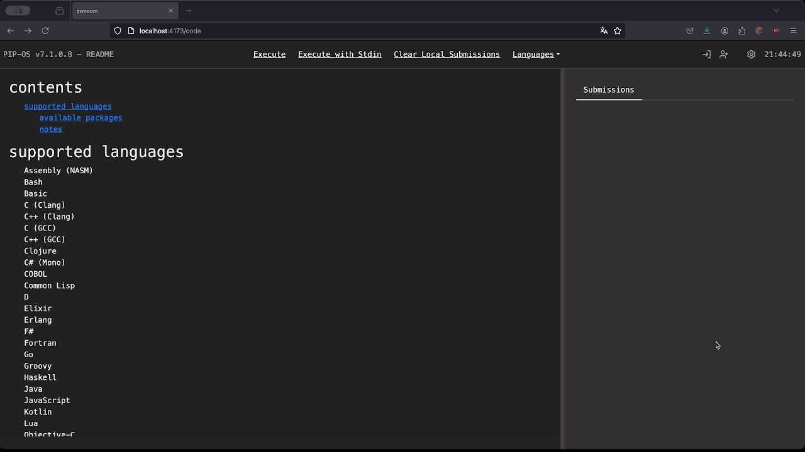

[main branch](https://code.cansu.dev)

[development branch](https://haul.code-cansu-dev.pages.dev) *unstable*

im currently migrating to nextjs, refactor, redesign parts here and there, so any feedbacks on development branch is welcome.

## beep

Code playground with 38 different environments, all with autocompletes, snippets, and syntax highlighters.

- [beep](#beep)
- [features](#features)
- [supported languages](#supported-languages)

## features

- Autocomplete and Snippets

- Share Code Output

- Stdin Support

- Execution and Loading Speed

- Network Friendly

From Haskell to NASM to Prolog to Lua, run everything with under 2 MB of network, all autocompletes and snippets included.

As a comparison, with no cache, from initial load to output, JDoodle consumes 3.05 megabytes for only loading COBOL. My precious darling loads needs only 1.6 MB of network initially, 
for loading all languages. Language switch takes almost nothing, where as JDoodle transfers 6 MB of network just to switch from COBOL to Fortran. 

Cached initial network transfer is only 4 KB, and executions, submissions, etc. takes only a few kilobytes per query.
- anime girl
live2d model that follows your mouse and reacts to your code / execution results. why? uh.

more to come, wip.

## supported languages

- Assembly (NASM)
- Bash 
- Basic
- C (Clang)
- C++ (Clang)
- C (GCC)
- C++ (GCC)
- Clojure
- C# (Mono)
- COBOL
- Common Lisp
- D
- Elixir
- Erlang
- F#
- Fortran
- Go
- Groovy
- Haskell
- Java
- JavaScript
- Kotlin
- Lua
- Objective-C
- OCaml
- Octave
- Pascal
- Perl
- PHP
- Prolog
- Python
- R
- Ruby
- Rust
- Scala
- SQL
- Swift
- TypeScript
- Visual Basic.NET

