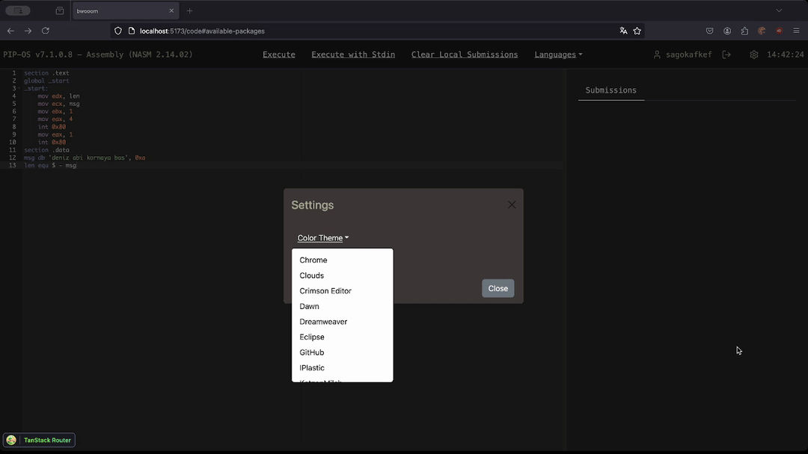

## important note

i am archiving this repository, and leaving web development as a hobby in entirety. i am still looking for work in webdev (but still prefer anything related to devops), i am just done with "fun side project website" things.

you can thank vite for ragequit.

if you want to read why, i have a very long tweet chain that shows progress of me losing every shred of my sanity caused by vite. good luck finding it. 

building this project was fun. goodbye. 

## beep

Code playground with 38 different environments, all with autocompletes, snippets, and syntax highlighters.

- [important note](#important-note)
- [beep](#beep)
- [features](#features)
- [supported languages](#supported-languages)
  - [available packages](#available-packages)
  - [notes](#notes)

## features

- Autocomplete and Snippets

- Share Code Output

- Stdin Support

- Execution and Loading Speed

- Network Friendly

This is what is most important to me in this project. You might say "dude we have unlimited gigabyte fiber internets who cares", but you can shove in all AI craps, popups, buzzwords,nothing will make me feel good as much as my sweet darling. From Haskell to NASM to Prolog to Lua, run everything with under 2 MB of network, all autocompletes and snippets included.

Here is a comparison with JDoodle. With no cache, from initial load to output, JDoodle consumes 3.05 megabytes. And this is only for COBOL. My precious darling loads needs only 900 KB of network initially, 
TO LOAD ALL LANGUAGES. Language switch only takes 200 kbs, where as JDoodle transfers 6 MB of network just to switch from COBOL to Fortran. And, JDoodle does not provide autocompletes and snippets.

here, check this video: https://youtu.be/St5z3afAguY (execution server is running on remote, somewhere in germany, during all demos)
- Dynamic Color Theme

more to come, wip.

## supported languages

- Assembly (NASM)
- Bash
- Basic
- C (Clang)
- C++ (Clang)
- C (GCC)
- C++ (GCC)
- Clojure
- C# (Mono)
- COBOL
- Common Lisp
- D
- Elixir
- Erlang
- F#
- Fortran
- Go
- Groovy
- Haskell
- Java
- JavaScript
- Kotlin
- Lua
- Objective-C
- OCaml
- Octave
- Pascal
- Perl
- PHP
- Prolog
- Python
- R
- Ruby
- Rust
- Scala
- SQL
- Swift
- TypeScript
- Visual Basic.NET

### available packages

- python
  - mlxtend
  - numpy
  - pandas
  - scikit-learn
  - pytest
  - scipy

wip

### notes

- Basic and Octave has no modes, so they are rendered as plain text.
- readme.md in editor is the same as this file except there are no gifs.